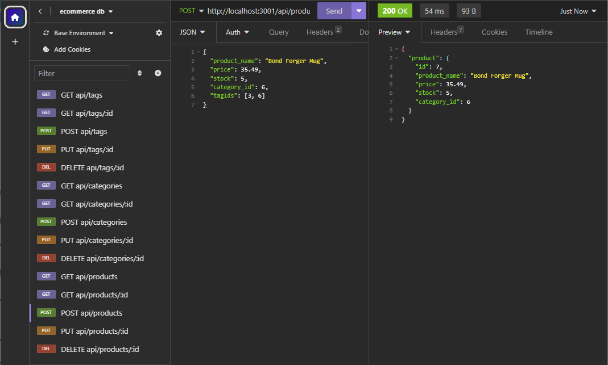
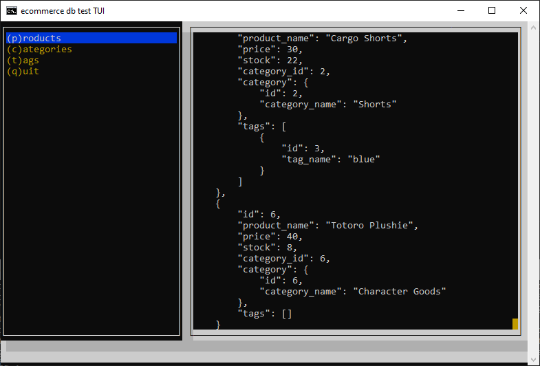

# E-Commerce DB Backend API



## Description

This repository demonstrates an implementation of a backend API for an e-commerce application. The database uses Sequelize as the ORM (Object-Relational Mapping) tool front-end to MySQL and expressJS to serve as the middleware webserver.


## Repository

[https://github.com/andrenrwn/ecommerce_db-api](https://github.com/andrenrwn/ecommerce_db-api)


## Installation

- nodeJS (if not yet installed)
- clone this repository
- npm install


## Usage

Pick one:

```$ node server.js```
```$ npm run start```

```$ nodemon server.js```
```$ npm run watch```


## Walkthrough videos

Click here to get the full list of walkthrough videos demonstrating this app:

[](WALKTHROUGH.md)


## API Reference

Click here for the full API documentation:
[API Reference](API.md)

<dl>
<dt><a href="API.md#GET /api/categories">GET /api/categories</a> ⇒ <code>ARRAY</code> | <code>JSON</code></dt>
<dd><p>Gets all categories, each including all its associated Products</p>
</dd>
<dt><a href="API.md#GET /api/categories/_id">GET /api/categories/:id</a> ⇒ <code>JSON</code></dt>
<dd><p>Get one category, including its associated list of products</p>
</dd>
<dt><a href="API.md#POST /api/categories">POST /api/categories</a> ⇒ <code>JSON</code> | <code>err</code></dt>
<dd><p>Create a new category in the database. A new category id is created if successful.</p>
</dd>
<dt><a href="API.md#PUT /api/categories/_id">PUT /api/categories/:id</a> ⇒ <code>JSON</code> | <code>err</code></dt>
<dd><p>Update an exsting category, based on the specified category :id</p>
</dd>
<dt><a href="API.md#DELETE /api/categories/_id">DELETE /api/categories/:id</a> ⇒ <code>JSON</code> | <code>err</code></dt>
<dd><p>Delete category entry specified by :id.</p>
</dd>
<dt><a href="API.md#GET /api/products">GET /api/products</a> ⇒ <code>ARRAY</code> | <code>JSON</code></dt>
<dd><p>Gets all products, including their associated Category and Tag data</p>
</dd>
<dt><a href="API.md#GET /api/products/_id">GET /api/products/:id</a> ⇒ <code>JSON</code></dt>
<dd><p>Get one product, including its associated Category and Tag data</p>
</dd>
<dt><a href="API.md#POST /api/products">POST /api/products</a> ⇒ <code>Object</code></dt>
<dd><p>Create a new product in the database, including its associated Category and Tag data.</p>
</dd>
<dt><a href="API.md#PUT /api/products/_id">PUT /api/products/:id</a> ⇒ <code>JSON</code></dt>
<dd><p>Update product, including its associated Category and Tag data. Tags data is updated after.</p>
</dd>
<dt><a href="API.md#DELETE /api/products/_id">DELETE /api/products/:id</a> ⇒ <code>JSON</code></dt>
<dd><p>Delete product entry specified by :id.</p>
</dd>
<dt><a href="API.md#GET /api/tags">GET /api/tags</a> ⇒ <code>ARRAY</code> | <code>JSON</code></dt>
<dd><p>Gets all tags, each including all its associated Products</p>
</dd>
<dt><a href="API.md#GET /api/tags/_id">GET /api/tags/:id</a> ⇒ <code>JSON</code></dt>
<dd><p>Get one tag, including its associated list of products</p>
</dd>
<dt><a href="API.md#POST /api/tags">POST /api/tags</a> ⇒ <code>JSON</code></dt>
<dd><p>Create a new category in the database. A new category id is created if successful.</p>
</dd>
<dt><a href="API.md#PUT /api/tags/_id">PUT /api/tags/:id</a> ⇒ <code>JSON</code></dt>
<dd><p>Update an exsting category, based on the specified category :id</p>
</dd>
<dt><a href="API.md#DELETE /api/tags/_id">DELETE /api/tags/:id</a> ⇒ <code>JSON</code></dt>
<dd><p>Delete tag entry specified by :id.</p>
</dd>
</dl>


## Use Cases and Testing

You can pre-populate the database for testing:

```$npm run seed```

or

```$node seeds/index.js```

### Text User Interface



You can run the following provided TUI (text user interface) script to test the API:

```$ node bin/tui.js```

or 

```$ npm run test```


### Insomnia

[Insomnia](https://insomnia.rest/): Load and use the following [Insomnia](https://insomnia.rest/) collection to interface with the API:

[Insomnia Collection: Insomnia_routes.json](test/Insomnia_routes.json)

### API Inspection in Browser

Chrome/Firefox browsers: Observe the API calls and its examples by loading this .HAR file into your browser's debug interface (F12):

[.HAR file: Insomnia_walkthrough.har](test/Insomnia_walkthrough.har)

## License

[MIT](LICENSE)

## Dependencies and Credits

The following are the npm dependencies of this application:

- dotenv    : Use environment variables for configuring database credentials
- express   : Web server middleware for NodeJS
- mysql2    : NodeJS interface to MySQL
- sequelize : ORM to help with Javascript coding of model relational models (SQL)

Dev dependencies: 

- jsdoc-to-markdown - generate a markdown version of the in-code documentation (used to render API.md)
- blessed           - Used by tui.js text example client


